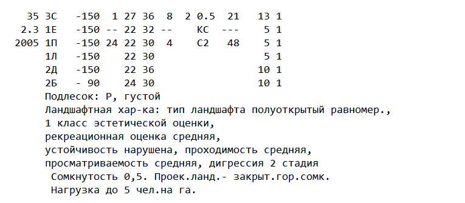
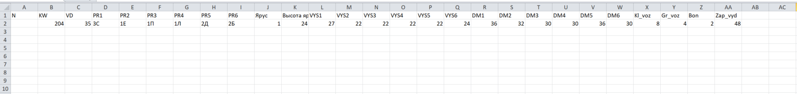

# forest_inventory
Special instrument for converting intentory cards in .txt format into .csv table

Convert text strings of layout shown on picture below:

to .csv table rows with layout shown on the next picture:

Used instruments - Python with default packages + Pandas
